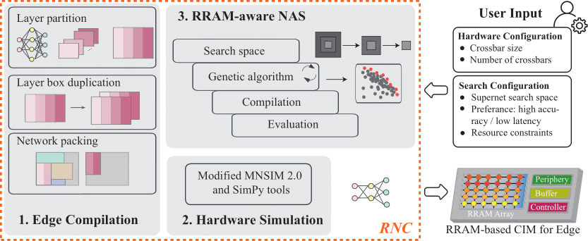
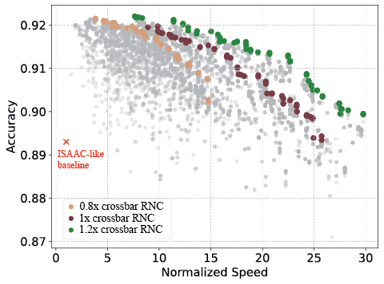

# rram_nas_comp_pack

The paper titled "RNC: Efficient RAM-aware NAS and Compilation for DNNs on Resource-Constrained Edge Devices" presents a novel framework aimed at optimizing deep neural networks (DNNs) specifically for deployment on edge devices with limited computational resources. 



## Requirements

install Python (== 3.9) dependencies.
Note: you need to use specific version of the library. See requirements.txt
```bash
wget https://repo.anaconda.com/miniconda/Miniconda3-latest-Linux-x86_64.sh
bash Miniconda3-latest-Linux-x86_64.sh
conda create -n rnc python=3.9
conda activate rnc
pip install -r requirments.txt
```
This project requires PyTorch and torchvision. However, the specific versions you need depend on your CUDA installation. Please install the appropriate versions for your system.

## Options

The following options can be passed as command-line arguments:

### General Options
- `--exp-id`: Experiment ID (default: 'dev')
- `--model`: Model for packing (options: resnet, mbv3_small, squeezenet; default: "mbv3_small")

** Extra model can be defined in `rram_nas_comp_pack/box_converter/models/` with pytorch for compilation**


## Hardware Configuration

The hardware configuration is defined in `SimConfig.ini`. Notably, the `Xbar_Size` parameter is crucial for defining the dimensions of the crossbar array:

- **Xbar_Size**: `128, 128` (Row, Column)

** The quantization bit of weight is fixed to 8-bit **


## Compilation
### Packing
Related options:
- `--num-crossbars`: Number of crossbars (default: 10)
- `--depth-split-factor`: Factor for depthwise layer split (default: 1)
- `--layer-threshold`: Threshold for layer conflict in crossbar (default: 1)
- `--xbar-max-load`: Max number of layers in crossbar (default: 6)
- `--no-pack-heuristic`: Disable packing heuristic (default: False)
- `--find-solution`: Enable solution finding with minimun number of crossbar (default: False)

To perform packing, you can call the script `test_packing.sh`. 
This script automates the packing process and generates following files in the `log/packing/[exp_id]/` directory:

`logs.log`: 
- **Experiment Configuration**: Initial parameters such as experiment ID, model type, number of crossbars, etc.
- **Packing Statistics**: Information on the number of boxes, crossbar constraints, utilized crossbars, leftover area, and utilization percentage.
- **Latency Measurements**: Recorded latency values for each evaluation, including ideal latency and latency ratios compared to both packed and baseline models.
- **Timing Information**: Breakdown of time taken for partitioning, packing, evaluation, and total execution time.

`partition.json`: 
- **idx**: Index of the layer in the model.
- **multiply**: Number of times the layer is duplicated.
- **box_raw**: 2D box representation of the layer.
- **boxes**: List of layer boxes after partition.
- **child_boxes**: List of layer boxes after duplication with boxes.

`pack.csv`: 
- **Layer Index**: Index of the layer in the model.
- **Crossbar Index**: Index of the crossbar where the layer is placed.
- **Location (X,Y)**: Coordinates of the layer on the crossbar.
- **Max X, Y**: Maximum x and y coordinates of the layer, indicating its size.

`sim.log`: 
- **Simulation Log**: Detailed log of the simulation process, including layer indices, crossbar indices, and timing information.

### Duplication

Related options:
- `--duplicate`: Enable duplication (default: False)

Margin factor for duplication is automatically tuned by the algorithm from 0.95 with step of 0.05.

To perform packing and duplication, you can call the script `test_packing_duplicate.sh`. 
This script automates the packing process and generates extra files in the `log/packing/[exp_id]/` directory:

`partition_optimized.json`: simular to `partition.json`, but after duplication.

## RRAM-NAS 
Related options:
- `--num-crossbars`: Number of crossbars (default: 10)
- `--num-sample`: Number of samples to evaluate in cycle/latency evaluation (default: 8)
- `--evolute-method`: Evolution method (options: ndga; default: "ndga")
- `--resume`: Resume evolution from checkpoint (default: False)

The pretrained ofa MobileNetV3 small should be downloaded from [here](https://huggingface.co/archiii/OFA_MBv3_small/blob/main/mbv3_small_best.pth.tar) and put in `ofa/checkpoint/mbv3_small_best.pth.tar`.

To perform the evolution for RRAM-NAS, you can call the script `run_evolution.sh`. 
This script automates the packing process and generates following files in the `log/evolution/[exp_id]/` directory:

`logs.log`: 
- **Experiment Configuration**: Initial parameters such as experiment ID, model type, number of crossbars, etc.
- **Evolution Statistics**: Information on the number of boxes, crossbar constraints, utilized crossbars, leftover area, and utilization percentage.

`checkpoint`: 
- **Checkpoint**: Checkpoint of the evolution process.

`evolute.csv`: 
- **Generation**: Generation of the evolution iternation.

## Results



## Acknowledgements
This project builds upon the 

- [Once for All](https://github.com/mit-han-lab/once-for-all) 
- [MNSIM-2.0](https://github.com/thu-nics/MNSIM-2.0)


We thank the authors for their valuable work.